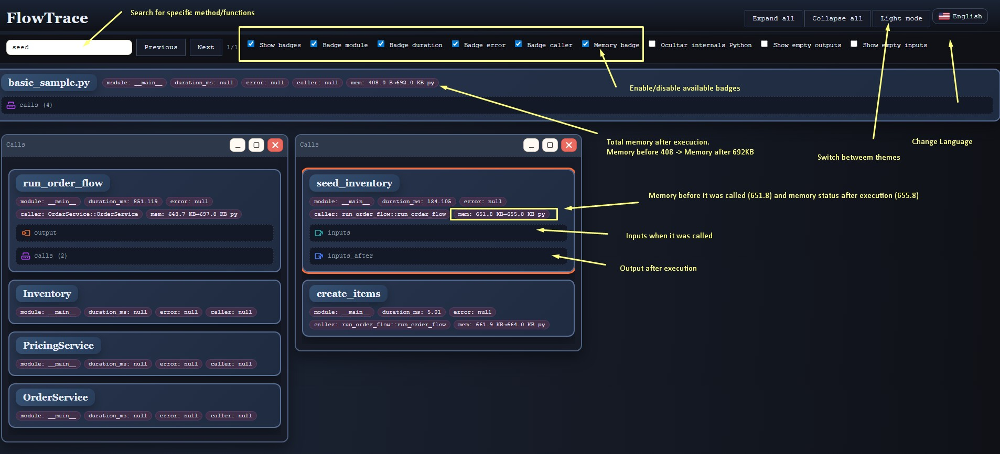
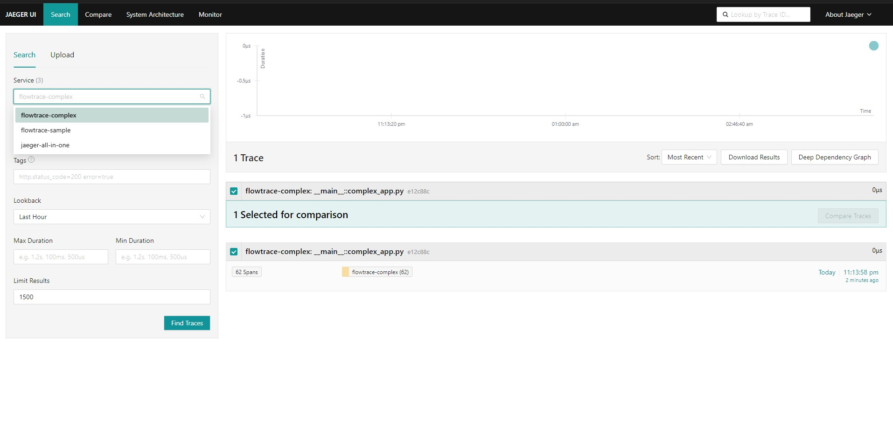
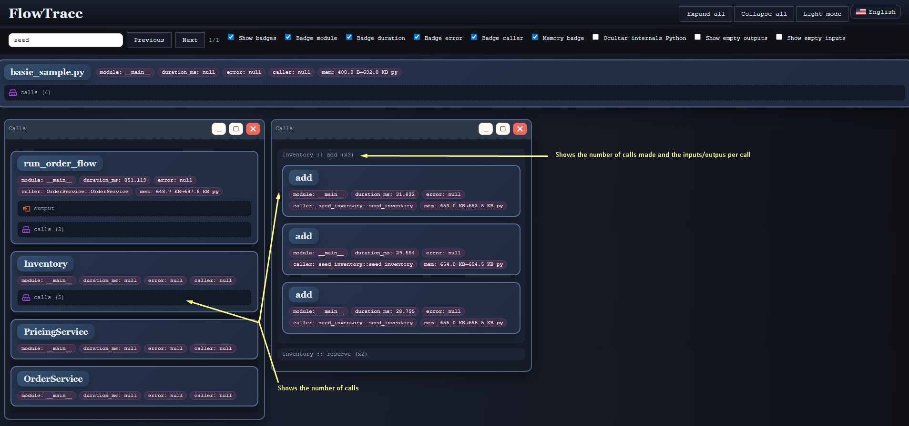

# PyTraceFlow

FlowTrace is a trace visualizer designed as a "post-mortem debugger": instead of pausing and resuming, it captures calls (inputs, outputs, caller, module, duration, errors) into a hierarchical JSON so you can inspect them later without re-running.

## Quick start (3 steps)
1. Capture the complex sample to JSON: `python flowtrace.py -s samples/complex/complex_app.py -o flowtrace_complex.json`
2. Render the HTML viewer: `python flowtrace_visual.py -i flowtrace_complex.json -o flowtrace_complex.html`

3. Optional export to OTLP/Jaeger (HTTP 4318): `python export_otlp.py -i flowtrace_complex.json --endpoint http://localhost:4318/v1/traces --service flowtrace-complex`

## Basic flow
1. Profile a script: `python flowtrace.py -s your_script.py -o flowtrace.json`
2. Generate the viewer: `python flowtrace_visual.py -i flowtrace.json -o flowtrace.html`
3. Open `flowtrace.html` and browse:
   - Search terms: opens the matching node in a floating panel.
   - Expand/collapse nodes; open calls.
   - Controls to show/hide badges, Python internals, language (es/en), and light/dark mode.

### Passing script arguments
- Any arguments unknown to `flowtrace.py` are forwarded to the profiled script (no `--` separator required).
- Example with options: `python flowtrace.py -s samples/basic/basic_sample.py --customer "ana maria" --tier gold --coffee 3`
- Example with positionals: `python flowtrace.py -s samples/basic/basic_positional_sample.py "juan perez" silver 1 2 0 0.18`

## Features
- Captures inputs/outputs, caller, module, duration, and errors.
- Groups instances and nested calls while preserving hierarchy.
- Search with highlighting and floating panels; option to hide Python internals.
- Dark mode by default, quick controls, and multi-language.
- Performance knobs: `--flush-interval` (seconds, <=0 disables background flush), `--flush-every-call` (legacy, slower), `--log-flushes` (stderr).
- Overhead controls: memoria desactivada por defecto; habilita con `--with-memory` (usa psutil + tracemalloc), o combina `--no-tracemalloc` / `--no-memory`. `--skip-inputs` evita serializar args/kwargs.
- Root entry now records total runtime; STDERR line: `[FlowTrace] Profiling finished in X.XXXs (script=...)`.
- Export existing traces to OTLP/Jaeger via `export_otlp.py`, with span names enriched by module and instance id to make nested calls distinct in Jaeger UI.

## CLI options
- `-s/--script` (required): target script path.
- `-o/--output`: JSON output path (default `flowtrace.json`).
- `--flush-interval`: seconds between background flushes; `<=0` disables thread (default `1.0`).
- `--flush-every-call`: force flush on every event (slow; legacy).
- `--log-flushes`: log each flush to stderr.
- `--with-memory`: enable memory snapshots (psutil + tracemalloc). Default is off; expect slower runs when enabled.
- `--no-memory`: disable memory snapshots.
- `--no-tracemalloc`: keep psutil but skip tracemalloc.
- `--skip-inputs`: do not serialize call inputs/outputs.
- OTLP export (optional, requires `opentelemetry-*`): `--export-otlp-endpoint http://localhost:4318/v1/traces`, `--export-otlp-service myapp`, repeat `--export-otlp-header key=value` for extra headers.
- Any other args are forwarded to the profiled script.

### Usage examples
- Default fast run: `python flowtrace.py -s samples/basic/basic_sample.py -o flowtrace.json`
- With memory metrics: `python flowtrace.py -s samples/basic/basic_sample.py --with-memory --flush-interval 2.0`
- Minimal overhead: `python flowtrace.py -s samples/basic/basic_sample.py --flush-interval 0 --skip-inputs`
- Legacy per-call flush with logs: `python flowtrace.py -s samples/basic/basic_sample.py --flush-every-call --log-flushes`
- Memory via psutil only: `python flowtrace.py -s samples/basic/basic_sample.py --with-memory --no-tracemalloc`
- Export to OTLP/HTTP: `python flowtrace.py -s samples/basic/basic_sample.py --export-otlp-endpoint http://localhost:4318/v1/traces --export-otlp-service flowtrace-sample`
- Export a saved trace to Jaeger (OTLP/HTTP, port 4318): `python export_otlp.py -i flowtrace.json --endpoint http://localhost:4318/v1/traces --service flowtrace-sample`
- Export with custom headers (auth/tenant): `python export_otlp.py -i flowtrace.json --endpoint http://localhost:4318/v1/traces --service flowtrace-sample --header Authorization=Bearer_TOKEN --header X-Tenant=acme`

## Included examples
- `script.py` basic example.
- `complex_app.py` with modules `demo/...` (prices, taxes, discounts).
- `conc_demo.py` with CPU-bound (multiprocessing) and IO-bound (threads) to view concurrent traces.
- `basic_positional_sample.py` shows the same flow using positional arguments.
- `error_sample.py` intentionally fails (missing config) to show the error badge.

## Backlog / ideas
- Filters by module/class/time.
- Export filtered views.

## License
MIT License. See `LICENSE` for full text.

---

FlowTrace es un visualizador de trazas de ejecucion, pensado como un "debugger post-mortem": en lugar de parar y reanudar, captura las llamadas (inputs, outputs, caller, modulo, duracion, errores) en un JSON jerarquico para inspeccionarlo despues sin reejecutar.

## Inicio rápido (3 pasos)
1. Capturar el ejemplo complejo a JSON: `python flowtrace.py -s samples/complex/complex_app.py -o flowtrace_complex.json`
2. Generar el visor HTML: `python flowtrace_visual.py -i flowtrace_complex.json -o flowtrace_complex.html`
3. Exportar a OTLP/Jaeger (HTTP 4318): `python export_otlp.py -i flowtrace_complex.json --endpoint http://localhost:4318/v1/traces --service flowtrace-complex`

## Flujo basico
1. Perfilar un script: `python flowtrace.py -s tu_script.py -o flowtrace.json`
2. Generar visor: `python flowtrace_visual.py -i flowtrace.json -o flowtrace.html`
3. Abrir `flowtrace.html` y navegar:
   - Buscar trminos: abre el nodo coincidente en panel flotante.
   - Expandir/colapsar nodos; abrir calls.
   - Controles para mostrar/ocultar badges, internals de Python, idioma (es/en) y modo claro/oscuro.

### Pasar argumentos al script
- Cualquier argumento que `flowtrace.py` no reconoce se reenvia al script perfilado (no hace falta `--`).
- Ejemplo con opciones: `python flowtrace.py -s samples/basic/basic_sample.py --customer "ana maria" --tier gold --coffee 3`
- Ejemplo con posicionales: `python flowtrace.py -s samples/basic/basic_positional_sample.py "juan perez" silver 1 2 0 0.18`

## Caracteristicas
- Captura inputs/outputs, caller, modulo, duracion y errores.
- Agrupa instancias y llamadas anidadas preservando jerarquia.
- Buscador con resaltado y paneles flotantes; opcion para ocultar internals de Python.
- Modo oscuro por defecto, controles rapidos y multilenguaje.
- Ajustes de performance: `--flush-interval` (segundos, <=0 desactiva flush en background), `--flush-every-call` (modo anterior, mas lento), `--log-flushes` (stderr).
- Controles de overhead: memoria viene desactivada por defecto; `--with-memory` la habilita (psutil + tracemalloc), combinable con `--no-tracemalloc` / `--no-memory`. `--skip-inputs` evita serializar args/kwargs.
- La llamada raiz registra el tiempo total; se imprime en STDERR `[FlowTrace] Profiling finished in X.XXXs (script=...)`.
- Export de trazas existentes a OTLP/Jaeger con `export_otlp.py`; los spans incluyen módulo e id de instancia para distinguir llamadas anidadas en Jaeger.

## Opciones CLI
- `-s/--script` (obligatorio): ruta del script a perfilar.
- `-o/--output`: ruta del JSON de salida (por defecto `flowtrace.json`).
- `--flush-interval`: segundos entre flushes en background; `<=0` desactiva el hilo (por defecto `1.0`).
- `--flush-every-call`: fuerza flush en cada evento (lento; legado).
- `--log-flushes`: loguea cada flush a stderr.
- `--with-memory`: habilita snapshots de memoria (psutil + tracemalloc). Por defecto está apagado; al activarlo las ejecuciones serán más lentas.
- `--no-memory`: desactiva snapshots de memoria.
- `--no-tracemalloc`: deja psutil pero omite tracemalloc.
- `--skip-inputs`: no serializa inputs/outputs de las llamadas.
- Export OTLP (opcional, requiere `opentelemetry-*`): `--export-otlp-endpoint http://localhost:4318/v1/traces`, `--export-otlp-service miapp`, headers extra con `--export-otlp-header clave=valor` (repetible).
- Cualquier otro argumento se reenvía al script perfilado.

### Ejemplos de uso
- Ejecución rápida por defecto: `python flowtrace.py -s samples/basic/basic_sample.py -o flowtrace.json`
- Con métricas de memoria: `python flowtrace.py -s samples/basic/basic_sample.py --with-memory --flush-interval 2.0`
- Overhead mínimo: `python flowtrace.py -s samples/basic/basic_sample.py --flush-interval 0 --skip-inputs`
- Flush por llamada con logs: `python flowtrace.py -s samples/basic/basic_sample.py --flush-every-call --log-flushes`
- Solo psutil (sin tracemalloc): `python flowtrace.py -s samples/basic/basic_sample.py --with-memory --no-tracemalloc`
- Export a OTLP/HTTP: `python flowtrace.py -s samples/basic/basic_sample.py --export-otlp-endpoint http://localhost:4318/v1/traces --export-otlp-service flowtrace-sample`
- Exportar un JSON ya capturado a Jaeger (OTLP/HTTP, puerto 4318): `python export_otlp.py -i flowtrace.json --endpoint http://localhost:4318/v1/traces --service flowtrace-sample`
- Exportar con cabeceras extra (auth/tenant): `python export_otlp.py -i flowtrace.json --endpoint http://localhost:4318/v1/traces --service flowtrace-sample --header Authorization=Bearer_TOKEN --header X-Tenant=acme`

## Ejemplos incluidos
- `script.py` ejemplo basico.
- `complex_app.py` con modulos `demo/...` (precios, impuestos, descuentos).
- `conc_demo.py` con CPU-bound (multiproceso) e IO-bound (hilos) para ver trazas concurrentes.
- `basic_positional_sample.py` muestra el mismo flujo usando argumentos posicionales.
- `error_sample.py` falla adrede (config faltante) para ver el badge de error.
- `error_internal_sample.py` falla dentro de una llamada interna (`validate_config`) para ver errores anidados.

## Pendientes / ideas
- Filtros por mdulo/clase/tiempo.
- Export de vistas filtradas.
- Integracin con spans/telemetra.

## Licencia
MIT License. Ver `LICENSE` para el texto completo.
